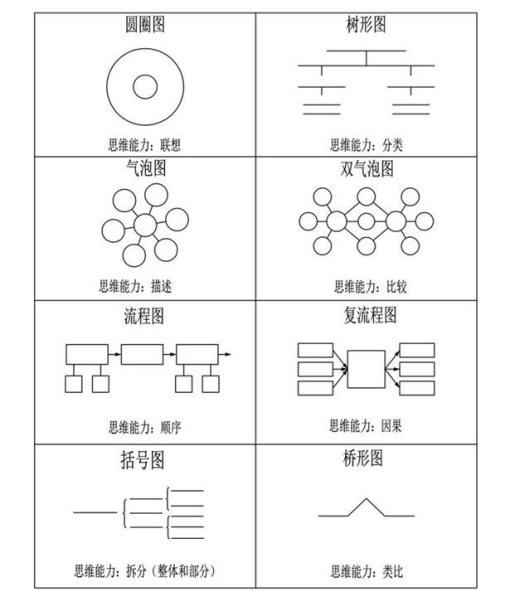

# 知识可视化Agent
## 项目介绍
本项目主要受哈佛大学教育学院博士大卫·海勒的《思维地图：化信息为知识的可视化工具》启发。
在该书中，大卫·海勒认为线性文本存在以下缺陷：
- 1.难以展现知识中的复杂模式。
- 2.容易超出学生的认知负荷。
- 3.与大脑加工信息并将信息转为知识时的自然运转方式存在认知失调。

在此基础上，他提出了对应八种基本认知技能的可视化工具。


**本项目尝试利用大型语言模型强大的语义理解和指令遵循能力，并依据大卫·海勒提出的八种可视化工具，将来源于书本、网络、博客等信息源的非结构化数据或半结构化数据转化为结构化数据，并进行可视化。**


注：本项目共实现了**气泡图、双泡图、树形图、流程图、括号图、复流程图**六种可视化工具，其余两种可视化工具（圆圈图、桥型图）主要由学习者自行绘制，故没有实现。

### 具体实现
- 1.接收指令
  - 接收用户输入的自然语言指令
- 2.指令重写（可选）
    - 使用LLM进行重写，使得指令内容更详细，格式更统一
- 3.获取可视化所需文本，支持以下三种方式：
    - 用户输入
    - 大模型根据指令**生成知识提示**（可选）
    - 事先存入向量数据库，并**检索**得到的（可选）
- 输入文本重写（可选）
    - 对于输入文本格式较差，检索得到多个片段的情况，可以让LLM对文本进行重写，从而保证输入文本的流程性和完整性。
- 根据要求结构化文档
    - 使用**路由链**找到对应结构化路由，抽取出输入文本中提示词模板相关信息，并以markdown格式输出。
- 结构化文档可视化：
    - 使用对应的可视化函数（**使用graphviz库实现**）对文档进行可视化

除本项目中实现的六种可视化工具，**用户也可以根据需要自定义其他可视化工具**，只需要在prompts.py中添加图像名称、介绍、指令模板，然后再实现相应的可视化函数将输出文本可视化即可。

## 使用方法
```


```
## 结果展示
测试数据：从网上搜集了涵盖语文、地理、历史、生物等学科的非结构化或半结构化文本，字数在一千到五千之间.

### 保路运动介绍 气泡图


### 真核生物与原核生物对比 双泡图


### 《红楼梦》第十三回 流程图


### 保路运动介绍 复流程图


### 地球气候分类 树状图


### 保路运动介绍 组织图

